# Who am I?
I am **Argha**, a student from India. I like to code things! HackNChat is just another example!

# Hack-N-Chat

  

Do you want to level up your CTF game? HackNChat is here for just that!

# What is it?
**HackNChat** is a small program made by me. Took me 4 months to bring it to life. It uses two methods of maneuverability, **Online** and **Offline** modes. 
<ins>**Online**</ins> mode includes the usage of **_Groq API_** to bring all your questions to an end! 
<ins>**Offline**</ins> mode uses Ollama model, for giving answers. It is offline, but user **must** prepare Ollama beforehand. This way, the App is as fast as your machine!
 
**<ins>What does it offer?<ins/>**
2 parts for each mode, Hackathon and CTFs. Till now I have mostly worked on CTFs, this includes **Cryptography toolkit**, **OSINT**, etc.
For Hackathons, there are a lot more to explore! By me **AND** by you!

# Some Screenshots

  
  
  

# DOWNLOAD AND START WINNING NOW!!!
Website: https://calmargha.github.io/HacknChat/
